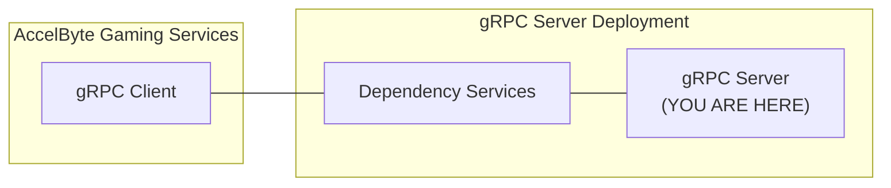

# rotating-shop-items-grpc-plugin-server-python



`AccelByte Gaming Services` capabilities can be extended using custom functions implemented in a `gRPC server`. If configured, custom functions in the `gRPC server` will be called by `AccelByte Gaming Services` instead of the default function.

The `gRPC server` and the `gRPC client` can actually communicate directly. However, additional services are necessary to provide **security**, **reliability**, **scalability**, and **observability**. We call these services as `dependency services`. The [grpc-plugin-dependencies](https://github.com/AccelByte/grpc-plugin-dependencies) repository is provided as an example of what these `dependency services` may look like. It
contains a docker compose which consists of these `dependency services`.

> :warning: **grpc-plugin-dependencies is provided as example for local development purpose only:** The dependency services in the actual gRPC server deployment may not be exactly the same.

## Overview

This repository contains a `rotating shop items gRPC server app` written in `Python`. It provides a simple custom rotating shop items function for platform service in AccelByte Gaming Services.

This sample app also shows how this `gRPC server` can be instrumented for better observability. 
It is configured by default to send metrics, traces, and logs to the observability `dependency services` in [grpc-plugin-dependencies](https://github.com/AccelByte/grpc-plugin-dependencies).

## Prerequisites

1. Windows 10 WSL2 or Linux Ubuntu 20.04 with the following tools installed.

   a. bash
  
   b. curl

   c. docker

   d. docker-compose v2.x

   e. docker loki driver

   ```
   docker plugin install grafana/loki-docker-driver:latest --alias loki --grant-all-permissions
   ```

   f. make
   
   g. Python v3.9

   h. git

   i. [ngrok](https://ngrok.com/)

   j. [postman](https://www.postman.com/)

2. A local copy of [grpc-plugin-dependencies](https://github.com/AccelByte/grpc-plugin-dependencies) repository.

   ```
   git clone https://github.com/AccelByte/grpc-plugin-dependencies.git
   ```

3. Access to `AccelByte Gaming Services` demo environment.

    a. Base URL: https://demo.accelbyte.io.

    b. [Create a Game Namespace](https://docs.accelbyte.io/esg/uam/namespaces.html#tutorials) if you don't have one yet. Keep the `Namespace ID`.

    c. [Create an OAuth Client](https://docs.accelbyte.io/guides/access/iam-client.html) with `confidential` client type. Keep the `Client ID` and `Client Secret`.

## Setup

To be able to run this sample app, you will need to follow these setup steps.

1. Create a docker compose `.env` file by copying the content of [.env.template](.env.template) file. 
2. Fill in the required environment variables in `.env` file as shown below.

   ```
   AB_BASE_URL=https://demo.accelbyte.io      # Base URL of AccelByte Gaming Services demo environment
   AB_CLIENT_ID='xxxxxxxxxx'                  # Use Client ID from the Setup section
   AB_CLIENT_SECRET='xxxxxxxxxx'              # Use Client Secret from the Setup section
   AB_NAMESPACE='xxxxxxxxxx'                  # Use Namespace ID from the Setup section
   PLUGIN_GRPC_SERVER_AUTH_ENABLED=false      # Enable or disable access token and permission verification
   ```

   > :warning: **Keep PLUGIN_GRPC_SERVER_AUTH_ENABLED=false for now**: It is currently not
   supported by AccelByte Gaming Services but it will be enabled later on to improve security. If it is
   enabled, the gRPC server will reject any calls from gRPC clients without proper authorization
   metadata.

## Building

To build this sample app, use the following command.

```
make build
```

To build and create a docker image of this sample app, use the following command.

```
make image
```

For more details about the command, see [Makefile](Makefile).

## Running

To run the existing docker image of this sample app which has been built before, use the following command.

```
docker-compose up
```

OR

To build, create a docker image, and run the this sample app in one go, use the following command.

```
docker-compose up --build
```

## Testing

### Functional Test in Local Development Environment

The custom functions in this sample app can be tested locally using `postman`.

1. Start the `dependency services` by following the `README.md` in the [grpc-plugin-dependencies](https://github.com/AccelByte/grpc-plugin-dependencies) repository.

   > :warning: **Make sure to start dependency services with mTLS disabled for now**: It is currently not supported by AccelByte Gaming Services but it will be enabled later on to improve security. If it is enabled, the gRPC client calls without mTLS will be rejected by Envoy proxy.

2. Start this `gRPC server` sample app.

3. Open `postman`, create a new `gRPC request`, and enter `localhost:10000` as server URL. 

   > :exclamation: We are essentially accessing the `gRPC server` through an `Envoy` proxy which is a part of `dependency services`.

4. Still in `postman`, continue by selecting `Section/GetRotationItems` method and invoke it with the sample message below.

   ```json
   {
      "namespace": "accelbyte",
      "userId": "c6354ec948604a1c9f5c026795e420d9",
      "sectionObject": {        
         "items": [
            {
                  "itemId": "7fcad276c5df4128b3f38564abd012c4",
                  "itemSku": "S1"
            },
            {
                  "itemId": "59ab1f45979e460295178deb609ec5d6",
                  "itemSku": "S2"
            },
            {
                  "itemId": "e51ae70222af4fba96ba8d7f631b8407",
                  "itemSku": "S3"
            },
            {
                  "itemId": "f790c28a58734212b594b0a161ffb297",
                  "itemSku": "S4"
            },
            {
                  "itemId": "f0f745e8dac14614a0c30470438ecfed",
                  "itemSku": "S5"
            },
            {
                  "itemId": "365ef7d7624b4f23b5d815ad1fd2f7cc",
                  "itemSku": "S6"
            },
            {
                  "itemId": "ce6d664c2c7f4c0fb488663814a33176",
                  "itemSku": "S7"
            },
            {
                  "itemId": "37eb332bf8e748f2a12f6ba19b4018df",
                  "itemSku": "S8"
            }            
         ],
         "sectionId": "c4d737f6f42c423e8690ff705ab75d9f",
         "sectionName": "example",
         "startDate": "1672519500",
         "endDate": "1675197900"
      }    
   }
   ```

5. If successful, you will see the item(s) in the response.

   ```json
   {
      "items": [
         {
            "itemId": "f0f745e8dac14614a0c30470438ecfed",
            "itemSku": "S5"
         }
      ]
   }
   ```

## Advanced

### Building Multi-Arch Docker Image

To create a multi-arch docker image of the project, use the following command.

```
make imagex
```

For more details about the command, see [Makefile](Makefile).
