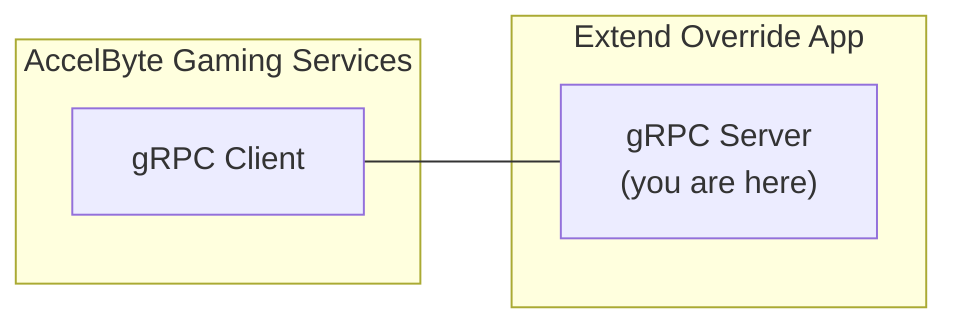

# rotating-shop-items-grpc-plugin-server-python



`AccelByte Gaming Services` (AGS) features can be customized with 
`Extend Override` apps. An `Extend Override` app is a `gRPC server` which 
contains one or more custom functions which can be called by AGS 
instead of the default functions.

## Overview

This repository serves as a template project for an `Extend Override` 
app for `rotating shop items` written in `Python`. You can clone this repository
and start implementing custom functions which can then be called by AGS.

By using this repository as a template project, you will get the recommended 
authentication and authorization implemented out-of-the-box. You will also get 
some instrumentation for observability so that metrics, traces, and 
logs will be available when the app is deployed.

As an example to get you started, this template project contains sample 
custom  rotating shop items function for 
platform service in `AccelByte Gaming Services`.

## Prerequisites

1. Windows 11 WSL2 or Linux Ubuntu 22.04 with the following tools installed.

   a. Bash

      ```
      bash --version

      GNU bash, version 5.1.16(1)-release (x86_64-pc-linux-gnu)
      ...
      ```

   b. Make

      - To install from Ubuntu repository, run: `sudo apt update && sudo apt install make` 

      ```
      make --version

      GNU Make 4.3
      ...
      ```

   c. Docker (Docker Engine v23.0+)

      - To install from Ubuntu repository, run: `sudo apt update && sudo apt install docker.io`
      - Add your user to `docker` group: `sudo usermod -aG docker $USER`
      - Log out and log back in so that the changes take effect

      ```
      docker version

      ...
      Server: Docker Desktop
       Engine:
        Version:          24.0.5
      ...
      ```

   d. Python 3.10

      - To install from Ubuntu repository, run: `sudo apt update && sudo apt install python3 python3-venv`

      ```
      python3 --version

      Python 3.10.12
      ```

   e. [Postman](https://www.postman.com/)

      - Use binary available [here](https://www.postman.com/downloads/)

2. Access to `AccelByte Gaming Services` environment.

   a. Base URL
   
      - For `Starter` tier e.g.  https://spaceshooter.prod.gamingservices.accelbyte.io
      - For `Premium` tier e.g.  https://dev.accelbyte.io
      
   b. [Create a Game Namespace](https://docs.accelbyte.io/gaming-services/tutorials/how-to/create-a-game-namespace/) if you don't have one yet. Keep the `Namespace ID`.

   c. [Create an OAuth Client](https://docs.accelbyte.io/gaming-services/services/access/authorization/manage-access-control-for-applications/#create-an-iam-client) with confidential client type. Keep the `Client ID` and `Client Secret`.

## Setup

To be able to run the sample custom functions, you will need to follow these 
setup steps.

1. Create a docker compose `.env` file by copying the content of [.env.template](.env.template) file.

   > :warning: **The host OS environment variables have higher precedence compared to `.env` file variables**: If the variables in `.env` file do not seem to take effect properly, check if there are host OS environment variables with the same name. 
   See documentation about [docker compose environment variables precedence](https://docs.docker.com/compose/environment-variables/envvars-precedence/) for more details.

2. Fill in the required environment variables in `.env` file as shown below.

   ```
   AB_BASE_URL=https://test.accelbyte.io     # Base URL of AccelByte Gaming Services environment
   AB_CLIENT_ID='xxxxxxxxxx'                 # Client ID from the Prerequisites section
   AB_CLIENT_SECRET='xxxxxxxxxx'             # Client Secret from the Prerequisites section
   AB_NAMESPACE='xxxxxxxxxx'                 # Namespace ID from the Prerequisites section
   PLUGIN_GRPC_SERVER_AUTH_ENABLED=true      # Enable or disable access token validation
   ```

   > :info: **In this sample app, PLUGIN_GRPC_SERVER_AUTH_ENABLED is `true` by default**: If it is set to `false`, the 
   `gRPC server` can be invoked without `AccelByte Gaming Services` access token. This option is provided for development 
   purpose only. It is recommended to enable `gRPC server` access token validation in production environment.

## Building

To build this sample app, use the following command.

```
make build
```

## Running

To (build and) run this sample app in a container, use the following command.

```
docker compose up --build
```

## Testing

### Test in Local Development Environment

> :warning: **To perform the following, make sure PLUGIN_GRPC_SERVER_AUTH_ENABLED is set to `false`**: Otherwise,
the gRPC request will be rejected by the `gRPC server`.

The custom functions in this sample app can be tested locally using [postman](https://www.postman.com/).

1. Run this `gRPC server` sample app by using the command below.

   ```shell
   docker compose up --build
   ```

2. Open `postman`, create a new `gRPC request`, and enter `localhost:6565` as server URL (tutorial [here](https://blog.postman.com/postman-now-supports-grpc/)). 

   > :warning: **If you are running [grpc-plugin-dependencies](https://github.com/AccelByte/grpc-plugin-dependencies) stack alongside this sample app as mentioned in [Test Observability](#test-observability)**: Enter `localhost:10000` instead of `localhost:6565`. This way, the `gRPC server` will be called via `Envoy` service within `grpc-plugin-dependencies` stack instead of directly.

3. Continue by selecting `Section/GetRotationItems` method and invoke it with the sample message below.

   ```json
   {
      "namespace": "accelbyte",
      "userId": "c6354ec948604a1c9f5c026795e420d9",
      "sectionObject": {        
         "items": [
            {
                  "itemId": "7fcad276c5df4128b3f38564abd012c4",
                  "itemSku": "S1"
            },
            {
                  "itemId": "59ab1f45979e460295178deb609ec5d6",
                  "itemSku": "S2"
            },
            {
                  "itemId": "e51ae70222af4fba96ba8d7f631b8407",
                  "itemSku": "S3"
            },
            {
                  "itemId": "f790c28a58734212b594b0a161ffb297",
                  "itemSku": "S4"
            },
            {
                  "itemId": "f0f745e8dac14614a0c30470438ecfed",
                  "itemSku": "S5"
            },
            {
                  "itemId": "365ef7d7624b4f23b5d815ad1fd2f7cc",
                  "itemSku": "S6"
            },
            {
                  "itemId": "ce6d664c2c7f4c0fb488663814a33176",
                  "itemSku": "S7"
            },
            {
                  "itemId": "37eb332bf8e748f2a12f6ba19b4018df",
                  "itemSku": "S8"
            }            
         ],
         "sectionId": "c4d737f6f42c423e8690ff705ab75d9f",
         "sectionName": "example",
         "startDate": "1672519500",
         "endDate": "1675197900"
      }    
   }
   ```

4. If successful, you will see the item(s) in the response.

   ```json
   {
      "items": [
         {
            "itemId": "59ab1f45979e460295178deb609ec5d6",
            "itemSku": "S2"
         }
      ]
   }
   ```

5. Still in `postman`, continue by selecting `Section/Backfill` method and invoke it with the sample message below.

   ```json
   {
   "userId": "c6354ec948604a1c9f5c026795e420d9",
   "namespace": "accelbyte",
   "items": [
      {
         "itemId": "7fcad276c5df4128b3f38564abd012c4",
         "itemSku": "S1",
         "owned": true,
         "index": 1
      },
      {
         "itemId": "59ab1f45979e460295178deb609ec5d6",
         "itemSku": "S2",
         "owned": false,
         "index": 2
      },
      {
         "itemId": "e51ae70222af4fba96ba8d7f631b8407",
         "itemSku": "S3",
         "owned": false,
         "index": 3
      }
   ],
   "sectionName": "example",
   "sectionId": "9f5c026795e420d9c6354ec948604a1c"
   }
   ```

6. If successful, you will see the item(s) in the response. The `itemId` will changed accordingly.

   ```json
   {
      "backfilledItems": [
         {
               "itemId": "687d110a30dc401ea5f76cd8fafff8e5",
               "itemSku": "",
               "index": 1
         }
      ]
   }
   ```

### Test with AccelByte Gaming Services

For testing this sample app which is running locally with `AccelByte Gaming Services`,
the `gRPC server` needs to be exposed to the internet. To do this without requiring 
public IP, we can use something like [ngrok](https://ngrok.com/).

1. Run this `gRPC server` sample app by using command below.

   ```shell
   docker compose up --build
   ```

2. Sign-in/sign-up to [ngrok](https://ngrok.com/) and get your auth token in `ngrok` dashboard.

3. In this sample app root directory, run the following helper command to expose `gRPC server` port in local development environment to the internet. Take a note of the `ngrok` forwarding URL e.g. `http://0.tcp.ap.ngrok.io:xxxxx`.

   ```
   make ngrok NGROK_AUTHTOKEN=xxxxxxxxxxx
   ```

   > :warning: **If you are running [grpc-plugin-dependencies](https://github.com/AccelByte/grpc-plugin-dependencies) stack alongside this sample app as mentioned in [Test Observability](#test-observability)**: Run the above 
   command in `grpc-plugin-dependencies` directory instead of this sample app directory. 
   This way, the `gRPC server` will be called via `Envoy` service within `grpc-plugin-dependencies` stack instead of directly.

4. [Create an OAuth Client](https://docs.accelbyte.io/guides/access/iam-client.html) with `confidential` client type with the following permissions.  Keep the `Client ID` and `Client Secret`. This is different from the Oauth Client from the Setup section and it is required by CLI demo app [here](demo/cli/) in the next step to register the `gRPC Server` URL.
   
   - For AGS Premium customers:
      - `ADMIN:NAMESPACE:{namespace}:CONFIG:SERVICEPLUGIN [READ,UPDATE,DELETE]`
      - `ADMIN:NAMESPACE:{namespace}:STORE [READ,CREATE,UPDATE,DELETE]`
      - `ADMIN:NAMESPACE:{namespace}:CATEGORY [CREATE]`
      - `ADMIN:NAMESPACE:{namespace}:CURRENCY [READ,CREATE,DELETE]`
      - `ADMIN:NAMESPACE:{namespace}:ITEM [READ,CREATE,DELETE]`
      - `NAMESPACE:{namespace}:USER:{userId}:STORE [READ]`
   - For AGS Starter customers:
      - Platform Store -> Service Plugin Config (Read, Update, Delete)
      - Platform Store -> Store (Read, Create, Update, Delete)
      - Platform Store -> Category (Create)
      - Platform Store -> Currency (Read, Create, Delete)
      - Platform Store -> Item (Read, Create, Delete)

   > :warning: **Oauth Client created in this step is different from the one from Setup section:** It is required by CLI demo app [here](demo/cli/) in the next step to register the `gRPC Server` URL.

5. Create a user for testing. Keep the `Username` and `Password`.

6. Set the necessary environment variables and run the [demo.py](demo/demo.py) script. The script will setup the necessary configuration, create test data, and run a user operation that triggers either `rotation` or `backfill` function in this `gRPC server` sample app.

   ```
   export AB_BASE_URL='https://test.accelbyte.io'
   export AB_CLIENT_ID='xxxxxxxxxx'       # Use Client ID from the previous step
   export AB_CLIENT_SECRET='xxxxxxxxxx'   # Use Client secret from the previous step
   export AB_NAMESPACE='xxxxxxxxxx'       # Use your Namespace ID
   export AB_USERNAME='xxxxxxxxxx'        # Use the username of test user you created
   export AB_PASSWORD='xxxxxxxxxx'        # Use the password of test user you created
   cd demo                 # Go to demo folder in this grpc server sample app
   make setup              # Run makefile target to setup virtualenv venv
   . venv/bin/activate     # Activate virtualenv venv
   python demo.py 0.tcp.ap.ngrok.io:xxxxx rotation    # For rotation function, using your ngrok forwarding URL
   python demo.py 0.tcp.ap.ngrok.io:xxxxx backfill    # For backfill function, using your ngrok forwarding URL
   ```
 
> :warning: **Ngrok free plan has some limitations**: You may want to use paid plan if the traffic is high.

### Test Observability

To be able to see the how the observability works in this sample app locally, there are few things that need be setup before performing tests.

1. Uncomment loki logging driver in [docker-compose.yaml](docker-compose.yaml)

   ```
    # logging:
    #   driver: loki
    #   options:
    #     loki-url: http://host.docker.internal:3100/loki/api/v1/push
    #     mode: non-blocking
    #     max-buffer-size: 4m
    #     loki-retries: "3"
   ```

   > :warning: **Make sure to install docker loki plugin beforehand**: Otherwise,
   this sample app will not be able to run. This is required so that container logs
   can flow to the `loki` service within `grpc-plugin-dependencies` stack. 
   Use this command to install docker loki plugin: `docker plugin install grafana/loki-docker-driver:latest --alias loki --grant-all-permissions`.

2. Clone and run [grpc-plugin-dependencies](https://github.com/AccelByte/grpc-plugin-dependencies) stack alongside this sample app. After this, Grafana 
will be accessible at http://localhost:3000.

   ```
   git clone https://github.com/AccelByte/grpc-plugin-dependencies.git
   cd grpc-plugin-dependencies
   docker-compose up
   ```

   > :exclamation: More information about [grpc-plugin-dependencies](https://github.com/AccelByte/grpc-plugin-dependencies) is available [here](https://github.com/AccelByte/grpc-plugin-dependencies/blob/main/README.md).

3. Perform testing. For example, by following [Test in Local Development Environment](#test-in-local-development-environment) or [Test with AccelByte Gaming Services](#test-with-accelbyte-gaming-services).

## Deploying

After done testing, you may want to deploy this app to `AccelByte Gaming Services`.

1. [Create a new Extend Override App on Admin Portal](https://docs.accelbyte.io/gaming-services/services/extend/override-ags-feature/getting-started-with-rotating-shop-items-customization/#create-the-extend-app). Keep the `Repository URI`.

2. Download and setup [extend-helper-cli](https://github.com/AccelByte/extend-helper-cli/) (only if it has not been done previously).

3. Perform docker login with `extend-helper-cli` using the following command.

   ```
   extend-helper-cli dockerlogin --namespace <my-game> --app <my-app> --login
   ```

   > :exclamation: For your convenience, the above `extend-helper-cli` command can also be 
   copied from `Repository Authentication Command` under the corresponding app detail page.

4. Build and push sample app docker image to AccelByte ECR using the following command.

   ```
   make imagex_push IMAGE_TAG=v0.0.1 REPO_URL=xxxxxxxxxx.dkr.ecr.us-west-2.amazonaws.com/accelbyte/justice/development/extend/xxxxxxxxxx/xxxxxxxxxx
   ```

   > :exclamation: **The REPO_URL is obtained from step 1**: It can be found under 'Repository URI' in the app detail.

5. Open Admin Portal, go to **Extend** -> **Overridable Features**. And then select the extend app.

6. To deploy selected image tag, click **Image Version History** and select 
   desired image tag to be deployed.

7. Click **Deploy Image**, confirm the deployment and go back to App Detail by 
   clicking **Cancel**.

8. Wait until app status is running.

## Next Step

Proceed to modify this template project and implement your own custom functions.
